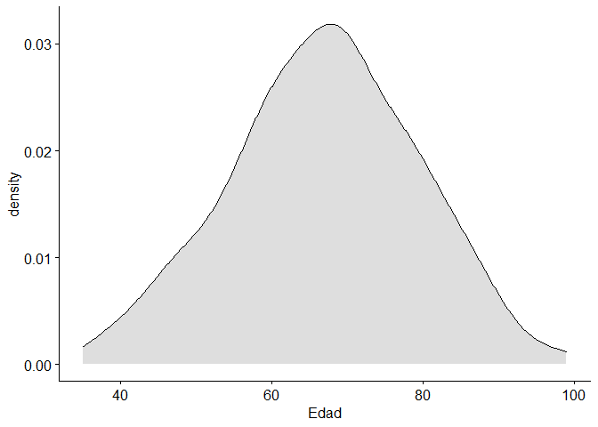
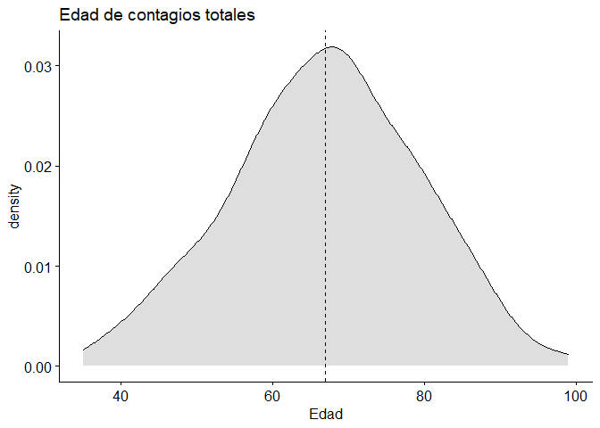
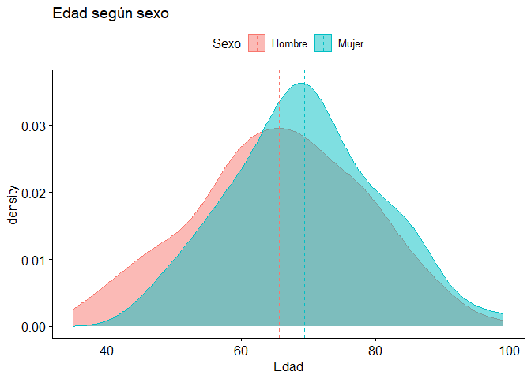
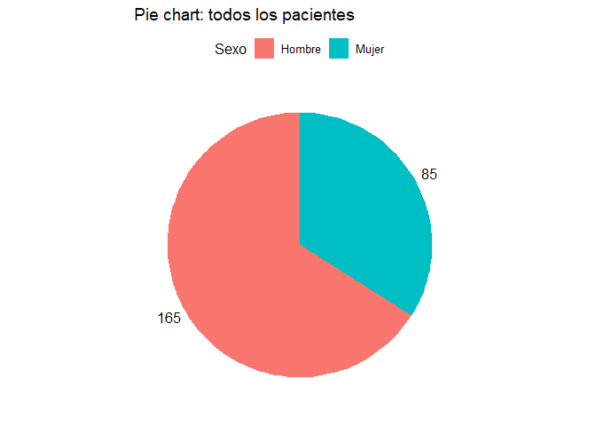
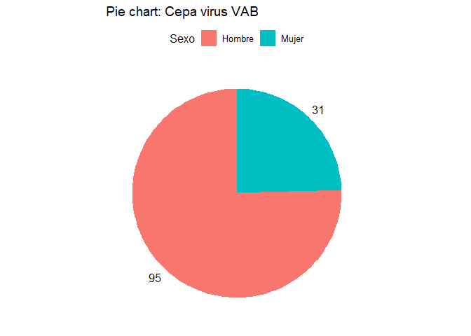
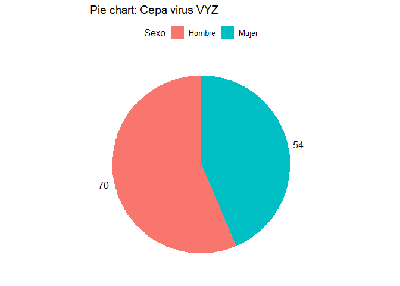
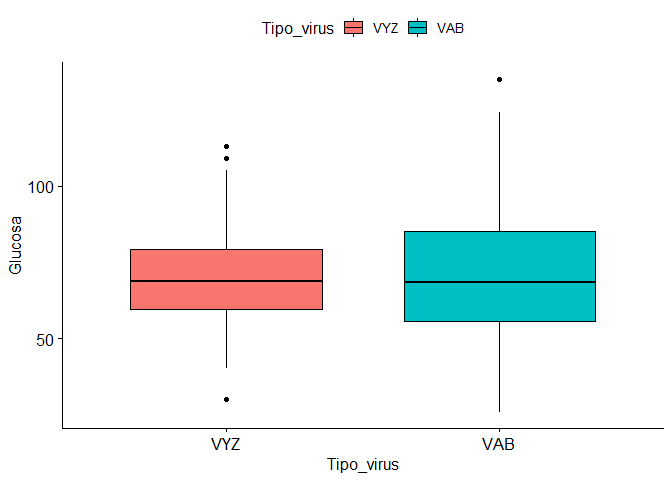
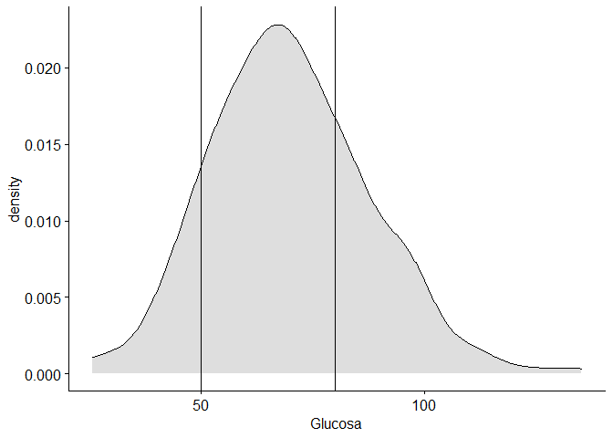

Datos del ejercicio
===================

En el fichero de Excel, CORONAVIRUS.xlsx se encuentran los datos
referentes a una muestra de datos de estos pacientes. El fichero dispone
de los siguientes datos:

-   Paciente: Identificador de paciente afectado
-   Coronavirus: Cepa de coronavirus que ha afectado al paciente
    (analíticamente demostrado).
-   Edad: Edad del paciente en el momento de su ingreso en la unidad
    hospitalaria.
-   Sexo: Sexo del paciente.
-   Glucosa: Nivel de glucosa en sangre del paciente en su ingreso en la
    unidad hospitalaria.
-   Pleocitosis: Nivel de pleocitosis en sangre del paciente en su
    ingreso en la unidad hospitalaria.
-   Proteinas: Nivel de proteinas en sangre del paciente en su ingreso
    en la unidad hospitalaria.
-   Plaquetas: Nivel de plaquetas en sangre del paciente en su ingreso
    en la unidad hospitalaria.
-   Natremia: Nivel de natremia en sangre del paciente en su ingreso en
    la unidad hospitalaria.
-   Tipo de tratamiento: tratamiento aplicado al paciente (A o B) para
    la cura del virus.
-   Días hospitalización: Tiempo que el paciente está ingresado en el
    hospital.
-   Efectos secundarios: diferentes efectos secundarios provocados por
    el tratamiento durante el periodo en el que el paciente ha estado
    ingresado en el hospital, como dolor de cabeza, náuseas,
    desorientación, afasia, crisis o herpes.

<table>
<thead>
<tr class="header">
<th style="text-align: left;">Tratamiento</th>
<th style="text-align: left;">Tipo_virus</th>
<th style="text-align: left;">Sexo</th>
<th style="text-align: right;">Edad</th>
<th style="text-align: right;">Glucosa</th>
<th style="text-align: right;">Pleocitosis</th>
<th style="text-align: right;">Proteinas</th>
<th style="text-align: right;">Plaquetas</th>
<th style="text-align: right;">Natremia</th>
<th style="text-align: right;">Dias_hospital</th>
<th style="text-align: left;">Dolor_cabeza</th>
<th style="text-align: left;">Nauseas</th>
<th style="text-align: left;">Desorientacion</th>
<th style="text-align: left;">Afasia</th>
<th style="text-align: left;">Crisis</th>
<th style="text-align: left;">Herpes</th>
</tr>
</thead>
<tbody>
<tr class="odd">
<td style="text-align: left;">A</td>
<td style="text-align: left;">VYZ</td>
<td style="text-align: left;">Hombre</td>
<td style="text-align: right;">82</td>
<td style="text-align: right;">83.0</td>
<td style="text-align: right;">100</td>
<td style="text-align: right;">67.00</td>
<td style="text-align: right;">240000</td>
<td style="text-align: right;">136</td>
<td style="text-align: right;">40</td>
<td style="text-align: left;">NO</td>
<td style="text-align: left;">SI</td>
<td style="text-align: left;">NO</td>
<td style="text-align: left;">NO</td>
<td style="text-align: left;">NO</td>
<td style="text-align: left;">NO</td>
</tr>
<tr class="even">
<td style="text-align: left;">A</td>
<td style="text-align: left;">VAB</td>
<td style="text-align: left;">Hombre</td>
<td style="text-align: right;">62</td>
<td style="text-align: right;">84.1</td>
<td style="text-align: right;">220</td>
<td style="text-align: right;">166.50</td>
<td style="text-align: right;">111532</td>
<td style="text-align: right;">132</td>
<td style="text-align: right;">31</td>
<td style="text-align: left;">SI</td>
<td style="text-align: left;">NO</td>
<td style="text-align: left;">NO</td>
<td style="text-align: left;">NO</td>
<td style="text-align: left;">NO</td>
<td style="text-align: left;">NO</td>
</tr>
<tr class="odd">
<td style="text-align: left;">A</td>
<td style="text-align: left;">VAB</td>
<td style="text-align: left;">Hombre</td>
<td style="text-align: right;">44</td>
<td style="text-align: right;">113.1</td>
<td style="text-align: right;">211</td>
<td style="text-align: right;">145.77</td>
<td style="text-align: right;">288199</td>
<td style="text-align: right;">127</td>
<td style="text-align: right;">22</td>
<td style="text-align: left;">NO</td>
<td style="text-align: left;">NO</td>
<td style="text-align: left;">NO</td>
<td style="text-align: left;">NO</td>
<td style="text-align: left;">NO</td>
<td style="text-align: left;">NO</td>
</tr>
<tr class="even">
<td style="text-align: left;">A</td>
<td style="text-align: left;">VAB</td>
<td style="text-align: left;">Mujer</td>
<td style="text-align: right;">52</td>
<td style="text-align: right;">45.9</td>
<td style="text-align: right;">202</td>
<td style="text-align: right;">162.54</td>
<td style="text-align: right;">320967</td>
<td style="text-align: right;">128</td>
<td style="text-align: right;">27</td>
<td style="text-align: left;">SI</td>
<td style="text-align: left;">NO</td>
<td style="text-align: left;">SI</td>
<td style="text-align: left;">SI</td>
<td style="text-align: left;">NO</td>
<td style="text-align: left;">NO</td>
</tr>
<tr class="odd">
<td style="text-align: left;">B</td>
<td style="text-align: left;">VAB</td>
<td style="text-align: left;">Hombre</td>
<td style="text-align: right;">69</td>
<td style="text-align: right;">25.8</td>
<td style="text-align: right;">264</td>
<td style="text-align: right;">138.46</td>
<td style="text-align: right;">163466</td>
<td style="text-align: right;">127</td>
<td style="text-align: right;">16</td>
<td style="text-align: left;">SI</td>
<td style="text-align: left;">SI</td>
<td style="text-align: left;">SI</td>
<td style="text-align: left;">NO</td>
<td style="text-align: left;">NO</td>
<td style="text-align: left;">SI</td>
</tr>
<tr class="even">
<td style="text-align: left;">B</td>
<td style="text-align: left;">VAB</td>
<td style="text-align: left;">Hombre</td>
<td style="text-align: right;">68</td>
<td style="text-align: right;">51.0</td>
<td style="text-align: right;">100</td>
<td style="text-align: right;">64.90</td>
<td style="text-align: right;">106000</td>
<td style="text-align: right;">131</td>
<td style="text-align: right;">30</td>
<td style="text-align: left;">NO</td>
<td style="text-align: left;">SI</td>
<td style="text-align: left;">NO</td>
<td style="text-align: left;">SI</td>
<td style="text-align: left;">NO</td>
<td style="text-align: left;">NO</td>
</tr>
</tbody>
</table>

Información relevante
=====================

Datos de interés relacionados con el estudio: Valores en sangre normales
de algunos parámetros:

Determinaciones Valores normales

<table>
<thead>
<tr class="header">
<th>Parámetro</th>
<th>Valores Normales</th>
</tr>
</thead>
<tbody>
<tr class="odd">
<td>Glucosa</td>
<td>50-80</td>
</tr>
<tr class="even">
<td>Pleocitosis</td>
<td>&lt;5</td>
</tr>
<tr class="odd">
<td>Proteinas</td>
<td>15-30</td>
</tr>
<tr class="even">
<td>Plaquetas</td>
<td>135.000-140.000</td>
</tr>
<tr class="odd">
<td>Natremia</td>
<td>140-145</td>
</tr>
</tbody>
</table>

Cargar los datos
================

Lo primero, cargamos los datos. Para ello, podemos clicar en el botón
“import Dataset” –&gt; “from Excel” en la pestaña environment arriba a
la derecha. Si da error, probablemente sea necesario instalar la
libraría readxl.

Guardamos los datos en la variable “CORONAVIRUS”.

En mi caso esto equivale a ejecutar:

    library(readxl)
    CORONAVIRUS <- read_excel("./CORONAVIRUS.xlsx")

Tu turno: Informe
=================

Con esta práctica se desea que el alumno aprenda a buscar la forma más
idónea de presentar la información obtenida a partir de un conjunto de
datos.

Para ello, el alumno debe conocer de qué distintas herramientas disponen
para presentar la información relevante (tipos de gráficos, tablas, …)
pero, sobre todo, debe de aprender a tener una rutina de pensamiento que
le ayude en cada caso a buscar la mejor manera de buscar evidencias en
los datos para corroborar ciertas sospechas (preguntas).

Ejercicio: Realice utilizando R y el paquete ggpubr los gráficos que
respondan a las siguientes preguntas. Deberá adjuntar en este documento
los siguientes elementos: - El código (copiar y pegar en el documento).
- Los gráficos (copiar y pegar en el documento). - Explicaciones y
respuestas a las preguntas.

    # Lo primero, cargamos las librerías...
    library(ggpubr)

    ## Loading required package: ggplot2

    ## Loading required package: magrittr

    colnames(CORONAVIRUS)

    ##  [1] "Tratamiento"    "Tipo_virus"     "Sexo"           "Edad"          
    ##  [5] "Glucosa"        "Pleocitosis"    "Proteinas"      "Plaquetas"     
    ##  [9] "Natremia"       "Dias_hospital"  "Dolor_cabeza"   "Nauseas"       
    ## [13] "Desorientacion" "Afasia"         "Crisis"         "Herpes"

Preguntas:
==========

Dibuje el gráfico de densidad de la edad.
-----------------------------------------

    ggdensity(CORONAVIRUS, x = "Edad", fill = "grey")

¿Cuál es la edad media de los contagiados por el virus? ¿Y según hombres y mujeres? Conteste utilizando gráficos y la función estadística necesaria.
----------------------------------------------------------------------------------------------------------------------------------------------------

    ggdensity(CORONAVIRUS, x = "Edad", fill = "grey", title = "Edad de contagios totales", add = "mean")

    ## Warning: geom_vline(): Ignoring `mapping` because `xintercept` was provided.

    ## Warning: geom_vline(): Ignoring `data` because `xintercept` was provided.

    ggdensity(CORONAVIRUS, x = "Edad", fill = "Sexo", color = "Sexo", title = "Edad según sexo", add = "mean")

    mean(CORONAVIRUS$Edad)

    ## [1] 66.952

    mean(CORONAVIRUS$Edad[CORONAVIRUS$Sexo == "Hombre"])

    ## [1] 65.66667

    mean(CORONAVIRUS$Edad[CORONAVIRUS$Sexo == "Mujer"])

    ## [1] 69.44706

¿A qué género de la población está afectando más estos dos virus? ¿Es el mismo comportamiento para ambos virus? Recomendación: utilice filtros para seleccionar los pacientes con cada tipo de virus, como aprendimos en el primer y segundo días de clase.
-----------------------------------------------------------------------------------------------------------------------------------------------------------------------------------------------------------------------------------------------------------

    aa <- data.frame(table(CORONAVIRUS$Sexo))
    colnames(aa) <- c("Sexo", "Frecuencia")
    ggpie(data = aa, x = "Frecuencia", color = "Sexo", fill = "Sexo", title = "Pie chart: todos los pacientes")

    bb <- data.frame(table(CORONAVIRUS$Sexo[CORONAVIRUS$Tipo_virus == "VAB"]))
    colnames(bb) <- c("Sexo", "Frecuencia")
    ggpie(data = bb, x = "Frecuencia", color = "Sexo", fill = "Sexo", title = "Pie chart: Cepa virus VAB")

    cc <- data.frame(table(CORONAVIRUS$Sexo[CORONAVIRUS$Tipo_virus == "VYZ"]))
    colnames(cc) <- c("Sexo", "Frecuencia")
    ggpie(data = cc, x = "Frecuencia", color = "Sexo", fill = "Sexo", title = "Pie chart: Cepa virus VYZ")

¿Afecta el tipo de virus a los valores de glucosa de los pacientes?
-------------------------------------------------------------------

    ggboxplot(data = CORONAVIRUS, y = "Glucosa", x = "Tipo_virus", fill = "Tipo_virus" )

¿Existen pacientes con valores de glucosa fuera de la normalidad? ¿En qué porcentaje?
-------------------------------------------------------------------------------------

Recomendación: añada el siguiente código al código de un density plot
para añadir líneas verticales “+ geom\_vline(xintercept = 50)”

    ggdensity(data = CORONAVIRUS, x = "Glucosa", fill = "gray") + geom_vline(xintercept = 50) + geom_vline(xintercept = 80)

    sum((CORONAVIRUS$Glucosa < 50) | (CORONAVIRUS$Glucosa > 80)) / nrow(CORONAVIRUS)*100

    ## [1] 39.2

¿Hay diferencias en los valores de Plaquetas de los pacientes debido al tipo de virus, y al sexo?
-------------------------------------------------------------------------------------------------

¿Hay diferencias entre los días de hospitalización dependiendo del tratamiento utilizado? ¿y en función del Sexo?
-----------------------------------------------------------------------------------------------------------------

¿Existe una asociación entre los días de hospitalización y la edad de los pacientes? ¿El sexo influye?
------------------------------------------------------------------------------------------------------

¿A qué porcentaje de pacientes estos tratamientos les provoca dolor de cabeza? Responder con gráfico y valor.
-------------------------------------------------------------------------------------------------------------

¿Están relacionadas las proteínas con las plaquetas?. ¿Influye el tipo de virus en alguno de estos valores?.
------------------------------------------------------------------------------------------------------------
